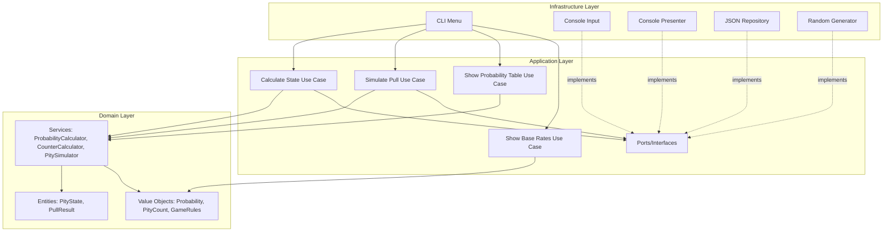
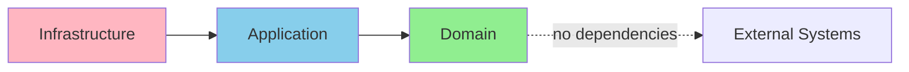
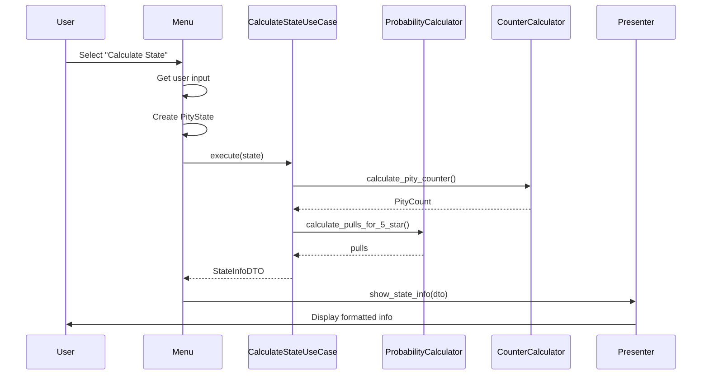
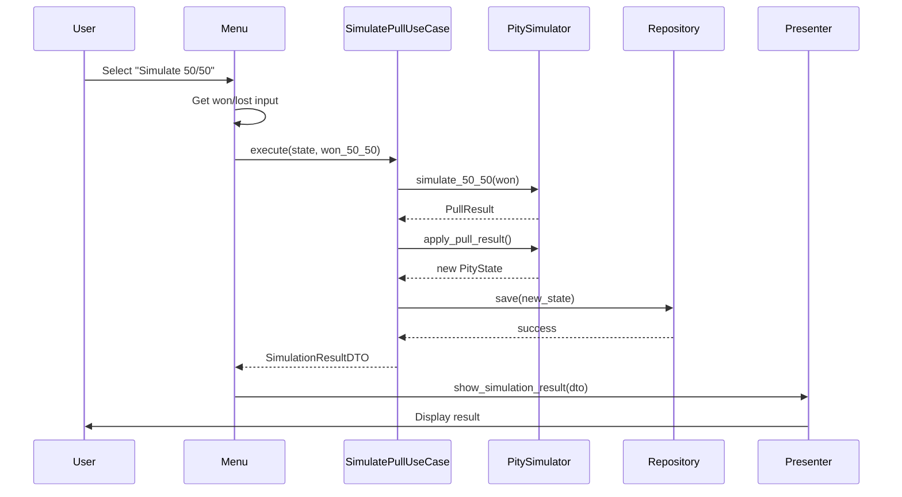

# Architecture Documentation

## Arknights: Endfield Pity Calculator - DDD Architecture

### Overview

This project has been refactored using **Domain-Driven Design (DDD)** principles with clean architecture, separating business logic from infrastructure concerns.

### Architecture Layers



### Dependency Flow



**Key Principle**: Dependencies flow inward. Domain has no external dependencies.

---

## Layer Details

### 1. Domain Layer (`src/domain/`)

The core business logic layer. Contains pure domain models and business rules.

#### Value Objects (`value_objects/`)

Immutable objects defined by their values:

- **`Probability`**: Represents probability values (0-1) with validation
- **`PityCount`**: Pity counter (0-80) with domain rules
- **`PullCount`**: Generic pull counter
- **`GameRules`**: Game configuration (rates, thresholds)

```python
# Example: Creating a probability
prob = Probability(value=0.5)
print(prob.as_percentage())  # 50.0%
```

#### Entities (`entities/`)

Objects with identity and lifecycle:

- **`PityState`**: Player's current pity state
  - Tracks: 6★ pity, 5★ pity, banner pulls, total pulls
  - Validates: Pity ≤ 80, total ≥ banner pulls
  - Methods: `increment_pull()`, `reset_6_star_pity()`

- **`PullResult`**: Result of a gacha pull
  - Attributes: rarity, character_type, won_50_50

```python
# Example: Creating and manipulating state
state = PityState.initial()
state = state.increment_pull()  # Returns new state (immutable)
assert state.pulls_without_6_star == 1
```

#### Services (`services/`)

Stateless business logic:

- **`ProbabilityCalculator`**: Calculates 6★ probabilities with soft pity
- **`CounterCalculator`**: Computes pity counters and milestones
- **`PitySimulator`**: Simulates gacha pulls (with injected randomness)

```python
# Example: Calculate probability
calc = ProbabilityCalculator(rules)
prob = calc.calculate_6_star_probability(pulls=65)  # Soft pity
```

---

### 2. Application Layer (`src/application/`)

Orchestrates domain logic and defines interfaces for infrastructure.

#### Use Cases (`use_cases/`)

Application-specific business logic:

- **`CalculateStateUseCase`**: Compute comprehensive state info
- **`SimulatePullUseCase`**: Simulate pull and persist result
- **`ShowProbabilityTableUseCase`**: Generate probability tables
- **`ShowBaseRatesUseCase`**: Retrieve game rules

```python
# Example: Use case execution
use_case = CalculateStateUseCase(prob_calc, counter_calc, rules)
info = use_case.execute(state)
```

#### Ports (`ports/`)

Abstract interfaces (using Protocol):

- **`StateRepository`**: Save/load state
- **`OutputPort`**: Display results
- **`InputPort`**: Get user input
- **`RandomGeneratorPort`**: Generate random numbers

**Dependency Inversion**: Application defines interfaces, infrastructure implements them.

#### DTOs (`dto/`)

Data Transfer Objects for cross-layer communication:

- **`StateInfoDTO`**: Complete state information
- **`SimulationResultDTO`**: Simulation outcome
- **`ProbabilityTableRowDTO`**: Table row data

---

### 3. Infrastructure Layer (`src/infrastructure/`)

Concrete implementations of ports and external system adapters.

#### Persistence (`persistence/`)

- **`JsonStateRepository`**: Saves state to `~/.endfield_pity_state.json`
  - Auto-backup on save
  - Schema versioning
  - Error handling

- **`StandardRandomGenerator`**: Wraps Python's `random.random()`

#### Presentation (`presentation/`)

- **`ConsolePresenter`**: Formats output for terminal
  - Tables, state info, simulation results
  - Implements `OutputPort`

#### CLI (`cli/`)

- **`ConsoleInput`**: Handles user input with validation
  - Implements `InputPort`

- **`PityCalculatorMenu`**: Main menu orchestrator
  - Routes user choices to use cases
  - Manages application flow

---

## Key Design Decisions

### 1. Pydantic for Domain Models

**Decision**: Use Pydantic v2 for all domain models.

**Rationale**:
- Automatic validation of invariants
- Type safety
- Immutability with `frozen=True`
- Better error messages

**Example**:
```python
# Invalid state rejected automatically
PityState(pulls_without_6_star=81)  # ValidationError: max 80
```

### 2. Immutable Domain Models

**Decision**: All value objects and entities are immutable.

**Rationale**:
- Thread safety
- Prevents accidental mutations
- Easier to test
- Clearer intent (functional style)

**Example**:
```python
state = state.increment_pull()  # Returns new state
```

### 3. Dependency Injection via Protocols

**Decision**: Use Protocol (structural subtyping) for ports.

**Rationale**:
- No runtime overhead
- IDE support
- Easier testing (no need for ABC)
- Pythonic

**Example**:
```python
class StateRepository(Protocol):
    def save(self, state: PityState) -> None: ...
```

### 4. Manual DI Container

**Decision**: Use manual dependency injection in `main.py`.

**Rationale**:
- Explicit and educational
- No magic
- Suitable for small project
- Easy to understand flow

### 5. Repository Pattern for Persistence

**Decision**: Abstract persistence behind repository interface.

**Rationale**:
- Easy to swap implementations (JSON → SQLite)
- Testable (mock repository)
- Domain doesn't know about JSON

---

## Testing Strategy

### Test Structure

```
tests/
├── conftest.py              # Shared fixtures
├── domain/                  # Unit tests for domain
│   ├── test_probability.py
│   ├── test_pity_state.py
│   └── test_probability_calculator.py
├── application/             # Use case tests
│   └── test_calculate_state_use_case.py
├── infrastructure/          # Adapter tests
│   └── test_json_repository.py
└── integration/             # End-to-end tests
    └── test_end_to_end.py
```

### Coverage Goals

- **Domain Layer**: >90% (critical business logic)
- **Application Layer**: >80% (use case orchestration)
- **Infrastructure Layer**: >60% (adapters, I/O)

### Testing Approach

1. **Domain**: Pure unit tests, no mocks needed
2. **Application**: Test use cases with mocked ports
3. **Infrastructure**: Test adapters with real dependencies
4. **Integration**: End-to-end flows with temporary files

---

## File Organization

```
src/
├── domain/
│   ├── entities/
│   │   ├── __init__.py
│   │   ├── pity_state.py
│   │   └── pull_result.py
│   ├── value_objects/
│   │   ├── __init__.py
│   │   ├── probability.py
│   │   ├── pity_count.py
│   │   └── game_rules.py
│   ├── services/
│   │   ├── __init__.py
│   │   ├── probability_calculator.py
│   │   ├── counter_calculator.py
│   │   └── pity_simulator.py
│   └── exceptions/
│       └── __init__.py
├── application/
│   ├── use_cases/
│   │   ├── __init__.py
│   │   ├── calculate_state.py
│   │   ├── simulate_pull.py
│   │   ├── show_probability_table.py
│   │   └── show_base_rates.py
│   ├── ports/
│   │   ├── __init__.py
│   │   ├── state_repository.py
│   │   ├── output_port.py
│   │   ├── input_port.py
│   │   └── random_generator.py
│   └── dto/
│       └── __init__.py
└── infrastructure/
    ├── persistence/
    │   ├── json_repository.py
    │   └── random_adapter.py
    ├── presentation/
    │   └── console_presenter.py
    └── cli/
        ├── console_input.py
        └── menu.py
```

---

## Sequence Diagrams

### Calculate State Flow



### Simulate Pull Flow



---

## Migration from Legacy Code

The legacy code (`src/_legacy/`) was procedural/functional. Key migrations:

| Legacy | New Architecture | Improvement |
|--------|------------------|-------------|
| `constants.py` | `GameRules` value object | Type-safe, immutable config |
| `counters.py` functions | `CounterCalculator` service | Organized, testable |
| `probability.py` functions | `ProbabilityCalculator` service | Single responsibility |
| `state.py` dicts | `PityState` entity | Validated, type-safe |
| `cli.py` monolith | `Menu` + Use Cases | Separated concerns |
| `display.py` mixed logic | `ConsolePresenter` | Presentation only |
| No persistence | `JsonStateRepository` | State preservation |
| No tests | Comprehensive test suite | Confidence, regression prevention |

---

## Benefits of This Architecture

### 1. Testability
- Domain logic testable without I/O
- Use cases testable with mocked ports
- High test coverage achievable

### 2. Maintainability
- Clear separation of concerns
- Easy to locate and change code
- Self-documenting structure

### 3. Extensibility
- Add new use cases easily
- Swap infrastructure (JSON → DB)
- Add new presentation (Web UI)

### 4. Type Safety
- Pydantic validation
- Protocol typing
- IDE autocomplete

### 5. Domain Focus
- Business logic clearly expressed
- No infrastructure leakage
- Domain experts can understand code

---

## Future Enhancements

### Potential Improvements

1. **Web Interface**
   - Add FastAPI adapter
   - Reuse all use cases
   - Only add new presentation layer

2. **Database Persistence**
   - Implement `SqliteStateRepository`
   - No domain/application changes needed

3. **Multiple Banner Types**
   - Extend `BannerInfo` entity
   - Add banner-specific rules

4. **Pull History**
   - Add `PullHistory` aggregate
   - Track all pulls over time

5. **Analytics**
   - Add `AnalyticsService`
   - Calculate long-term statistics

---

## Running the Application

### Installation

```bash
make install
```

### Running

```bash
make run
# or
python main.py
```

### Testing

```bash
make test          # Run all tests
make coverage      # Run with coverage report
```

### Development

```bash
make clean         # Clean cache files
make lint          # Check code quality
```

---

## References

- **Domain-Driven Design**: Eric Evans
- **Clean Architecture**: Robert C. Martin
- **Pydantic Documentation**: https://docs.pydantic.dev/
- **Python Protocols (PEP 544)**: https://peps.python.org/pep-0544/

---

**Last Updated**: February 2, 2026
**Version**: 0.2.0
