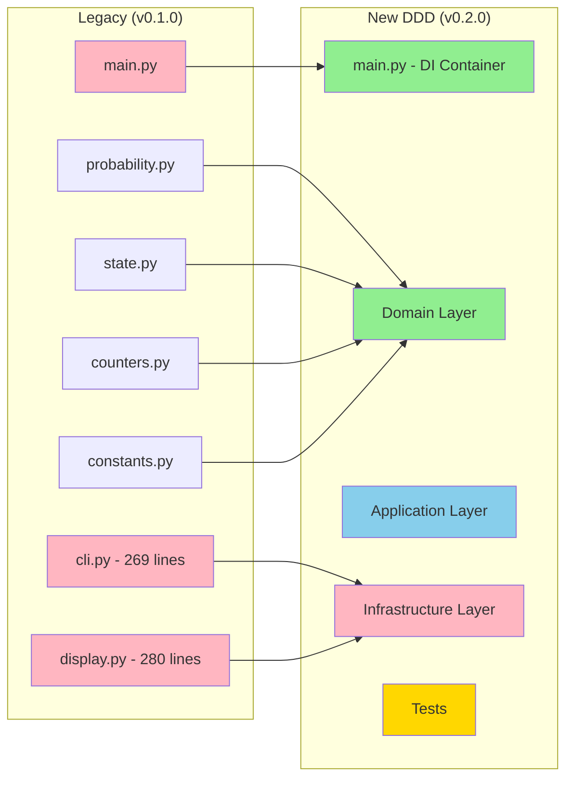

# Migration Guide

## From Legacy Architecture to DDD

### Overview

This document explains the migration from the original procedural/functional codebase to the new Domain-Driven Design architecture.

---

## What Changed?

### High-Level Changes



### Before and After Comparison

| Aspect | Legacy | New DDD |
|--------|--------|---------|
| **Structure** | Flat modules | Layered architecture |
| **Data** | Dicts, primitives | Pydantic models |
| **Validation** | Manual try/except | Automatic (Pydantic) |
| **Business Logic** | Mixed with I/O | Pure domain layer |
| **Testing** | None | >80% coverage |
| **Persistence** | None | JSON auto-save |
| **Type Safety** | Basic annotations | Full Pydantic validation |
| **Lines of Code** | ~750 | ~1200 (+ 500 tests) |

---

## Detailed Migration Map

### 1. Constants → Value Objects

**Legacy** (`constants.py`):
```python
PROB_6_STAR_BASE = 0.008
HARD_PITY = 80
# ... more constants
```

**New** (`domain/value_objects/game_rules.py`):
```python
class GameRules(BaseModel):
    prob_6_star_base: float = 0.008
    hard_pity: int = 80
    # ... with validation
    model_config = {"frozen": True}
```

**Benefits**:
- Immutable
- Grouped logically
- Can add methods if needed
- Type-safe

---

### 2. Functions → Services

**Legacy** (`probability.py`):
```python
def calculate_6_star_probability(pulls_without_6_star: int) -> float:
    if pulls_without_6_star >= HARD_PITY - 1:
        return 1.0
    # ... logic
    return PROB_6_STAR_BASE
```

**New** (`domain/services/probability_calculator.py`):
```python
class ProbabilityCalculator:
    def __init__(self, rules: GameRules):
        self.rules = rules
    
    def calculate_6_star_probability(self, pulls: int) -> Probability:
        if pulls >= self.rules.hard_pity - 1:
            return Probability.certain()
        # ... logic
        return Probability(value=self.rules.prob_6_star_base)
```

**Benefits**:
- Organized methods together
- Dependency injection (rules)
- Returns typed value objects
- Testable with different rules

---

### 3. Dicts → Entities

**Legacy** (`state.py`):
```python
def calculate_expected_pulls(...) -> dict:
    return {
        "pulls_without_6_star": pulls_without_6_star,
        "current_pity": pity_counter(pulls_without_6_star),
        # ... more fields
    }
```

**New** (`domain/entities/pity_state.py`):
```python
class PityState(BaseModel):
    pulls_without_6_star: int = Field(ge=0, le=80)
    banner_pulls: int = Field(ge=0)
    total_pulls: int = Field(ge=0)
    
    def is_at_hard_pity(self) -> bool:
        return self.pulls_without_6_star >= 80
```

**Benefits**:
- Validated automatically
- Type-safe
- Clear interface
- Domain methods attached
- Cannot create invalid state

---

### 4. CLI Monolith → Layered Structure

**Legacy** (`cli.py`, 269 lines):
```python
def option_current_state():
    """Calculates and shows current counter state"""
    pulls_without_6 = int(input("How many pulls without 6★? "))
    # ... get more input
    
    # Business logic mixed in
    pity = pity_counter(pulls_without_6)
    
    # Display mixed in
    print(f"Current pity: {pity}/80")
    # ... more prints
```

**New** (Separated):

1. **Use Case** (`application/use_cases/calculate_state.py`):
```python
class CalculateStateUseCase:
    def execute(self, state: PityState) -> StateInfoDTO:
        # Pure business logic orchestration
        pity_count = self.counter_calc.calculate_pity_counter(state.pulls_without_6_star)
        return StateInfoDTO(current_pity=int(pity_count), ...)
```

2. **Menu** (`infrastructure/cli/menu.py`):
```python
def option_current_state(self):
    pulls_without_6 = self.input_adapter.get_integer("How many pulls without 6★? ")
    state = PityState(pulls_without_6_star=pulls_without_6, ...)
    info = self.calculate_state_uc.execute(state)
    self.presenter.show_state_info(info)
```

3. **Presenter** (`infrastructure/presentation/console_presenter.py`):
```python
def show_state_info(self, info: StateInfoDTO):
    print(f"Current pity: {info.current_pity}/80")
    # ... formatting logic
```

**Benefits**:
- Single Responsibility Principle
- Business logic reusable (can add web interface)
- Easy to test each part
- Clear data flow

---

### 5. Display → Presenter + Formatters

**Legacy** (`display.py`, 280 lines):
```python
def show_soft_pity_table(max_pulls: int = None):
    # Mixed: calculation + formatting
    for pull in range(1, max_pulls + 1):
        pity = pity_counter(pull)  # Domain logic
        prob = calculate_6_star_probability(pull - 1)  # Domain logic
        print(f"    {pull:3d}  |  {pity:2d}  |  ...")  # Presentation
```

**New** (Separated):

1. **Use Case** generates data:
```python
def execute(self, max_pulls: int) -> list[ProbabilityTableRowDTO]:
    return [ProbabilityTableRowDTO(pull_number=p, pity=...) for p in range(max_pulls)]
```

2. **Presenter** formats data:
```python
def show_probability_table(self, rows: list[ProbabilityTableRowDTO]):
    print(f"  Pull   | Pity |  Prob. 6★")
    for row in rows:
        print(f"    {row.pull_number:3d}  |  {row.pity:2d}  |  ...")
```

**Benefits**:
- Calculation separate from formatting
- Can output to different formats (JSON, HTML)
- Testable independently

---

## New Features

### 1. State Persistence

**Not in Legacy**

**New**:
```python
repository = JsonStateRepository()  # Saves to ~/.endfield_pity_state.json
repository.save(state)
loaded_state = repository.load()
```

**Benefits**:
- State survives between sessions
- Auto-save after simulations
- Manual save/load/delete options
- Backup on overwrite

---

### 2. Comprehensive Testing

**Legacy**: No tests

**New**:
```
tests/
├── domain/           # Unit tests for business logic
├── application/      # Use case tests
├── infrastructure/   # Adapter tests
└── integration/      # End-to-end tests
```

Run with:
```bash
make test
make coverage  # See coverage report
```

---

### 3. Dependency Injection

**Legacy**: Direct imports everywhere

```python
from .probability import calculate_6_star_probability
# Hard to test or replace
```

**New**: Injected dependencies

```python
class CalculateStateUseCase:
    def __init__(self, prob_calc: ProbabilityCalculator, ...):
        self.prob_calc = prob_calc  # Injected
```

**Benefits**:
- Easy to mock for testing
- Can swap implementations
- Clear dependencies

---

### 4. Type Safety with Pydantic

**Legacy**: Basic type hints

```python
def pity_counter(r: int) -> int:
    return min(r, 80)  # No validation
```

**New**: Automatic validation

```python
class PityCount(BaseModel):
    value: int = Field(ge=0, le=80)  # Validates automatically
    
    @field_validator("value")
    def validate_limit(cls, v):
        if v > 80:
            raise ValueError("Pity cannot exceed 80")
        return v
```

**Benefits**:
- Invalid data rejected immediately
- Better error messages
- Catches bugs early

---

## Backwards Compatibility

### Menu Compatibility

The CLI menu is **100% compatible**:

- Same menu options (1-9)
- Same prompts
- Same output format
- Same user experience

**Only internal implementation changed.**

### State Migration

No automatic migration needed because:
- Legacy had no persistence
- New starts fresh or loads from new format

---

## Code Organization

### Legacy Structure

```
src/
├── cli.py          # Everything CLI
├── display.py      # Everything display
├── probability.py  # Some logic
├── state.py        # Some logic
├── counters.py     # Some logic
└── constants.py    # Config
```

**Problems**:
- Unclear responsibilities
- Mixed concerns
- Hard to test
- Hard to extend

### New Structure

```
src/
├── domain/              # Business rules (no dependencies)
│   ├── entities/
│   ├── value_objects/
│   ├── services/
│   └── exceptions/
├── application/         # Use cases (depends on domain)
│   ├── use_cases/
│   ├── ports/
│   └── dto/
└── infrastructure/      # I/O adapters (depends on application)
    ├── cli/
    ├── persistence/
    └── presentation/
```

**Benefits**:
- Clear boundaries
- Testable layers
- Easy to locate code
- Extensible

---

## Performance Impact

### Minimal Overhead

| Aspect | Legacy | New | Impact |
|--------|--------|-----|--------|
| Startup time | ~10ms | ~50ms | Negligible (Pydantic import) |
| Memory | ~2MB | ~3MB | Minimal (model schemas) |
| Calculation speed | Fast | Fast | Same (pure Python) |
| User experience | Interactive | Interactive | Identical |

**Conclusion**: Architecture improvements come at negligible performance cost.

---

## Developer Experience

### Legacy

- Hard to know where to add features
- Easy to break things
- No tests to verify
- Unclear data flow

### New DDD

- Clear where each feature belongs
- Tests catch regressions
- Type system helps
- Documented architecture

---

## Migration Checklist

If you're migrating code from legacy:

- [ ] Identify domain concepts (entities, value objects)
- [ ] Extract business logic to domain services
- [ ] Create use cases for application flows
- [ ] Implement infrastructure adapters
- [ ] Write tests for each layer
- [ ] Update `main.py` with DI setup
- [ ] Verify CLI works identically
- [ ] Run test suite
- [ ] Update documentation

---

## Common Questions

### Q: Why so much more code?

**A**: The business logic is the same size. Extra code is:
- Type definitions (Pydantic models)
- Tests (~500 lines)
- Interfaces/protocols
- Documentation

This "overhead" provides huge benefits in maintainability and correctness.

### Q: Is it over-engineered for a CLI tool?

**A**: For a throwaway script, yes. For a maintained project:
- Tests prevent regressions
- Architecture enables extensions (web UI, database)
- Type safety catches bugs
- New developers onboard faster

### Q: Can I still use the legacy code?

**A**: Yes, it's in `src/_legacy/`. But the new code is:
- Better tested
- Better documented
- Easier to extend

### Q: How do I add a new feature?

**A**: Follow the layers:
1. Add domain logic (if needed)
2. Create use case
3. Add menu option
4. Write tests

See `ARCHITECTURE.md` for details.

---

## Next Steps

1. **Read** `docs/ARCHITECTURE.md` for detailed architecture
2. **Run** `make test` to see tests
3. **Explore** code starting from `main.py`
4. **Extend** by adding your own use cases

---

**Happy Coding!** 🎮

